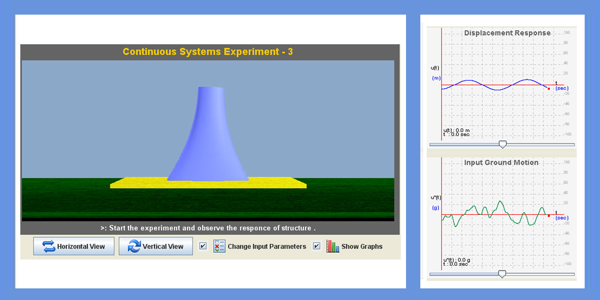

Some special type of structures like cooling towers, bunkers and silos are considered as continuous systems. These type of structures have importance in their functionality. Some of the continuous systems may have different type of profiles like rectangular, trapezoidal, hyperboloid etc. Their response due to dynamic loading varies for different profiles.

To know the response of structure for different profiles and for different behavior (shear(fixed), bending, shear(hinge)) of the structure.

 
