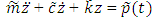
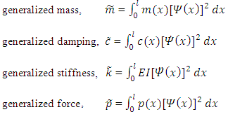

The continuous systems are more complex systems for doing their analysis. So for developing analysis of this complex system, we will treat it as SDOF system which usually calls as generalized SDOF systems.

Equation of motion for a generalized SDOF system is,

 
 

where,

 
 

[Read More](doc/9.theory.pdf)
